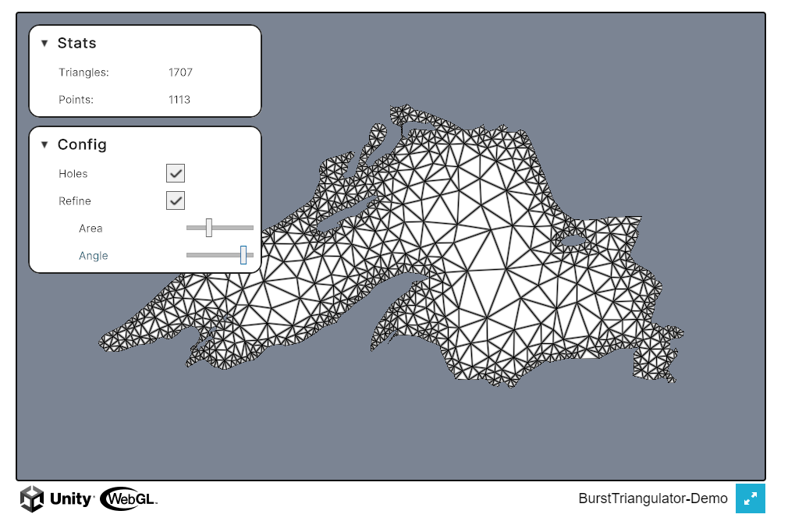

# BurstTriangulator-Demo

This repository contains a demo project for the  package.
It provides an interactive demonstration of the basic capabilities of the original package.

Feel free to contribute to this demo by submitting a merge request or opening an issue!

